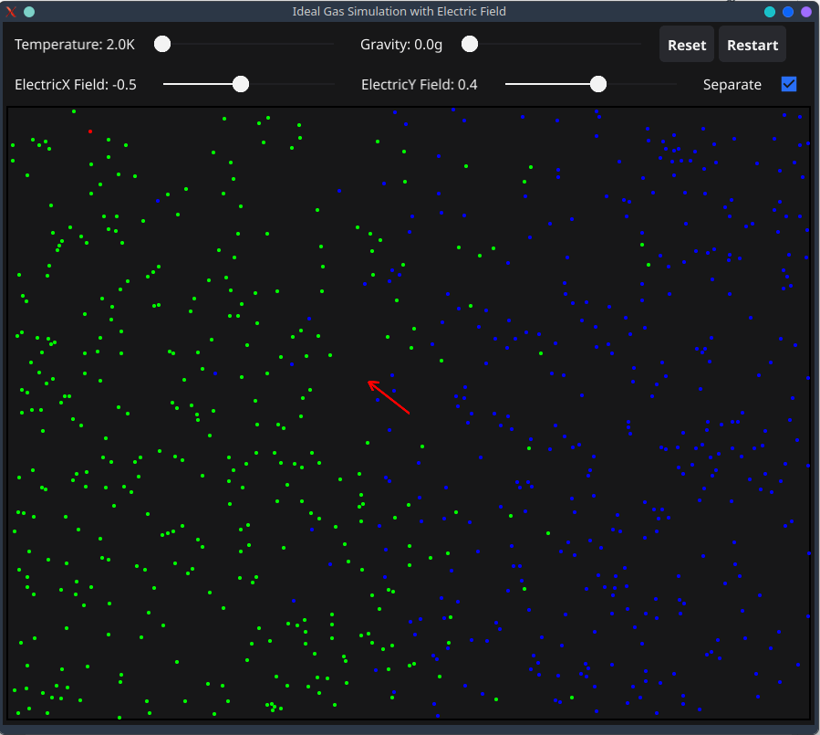

# GoGasSimulator

A visual simulation of ideal gas molecules with temperature and electric field controls, built in Go using the Fyne GUI toolkit.

|

## Overview

**GoGasSimulator** is an interactive application that simulates the behavior of ideal gas molecules within a container. It provides controls to adjust temperature and apply an external electric field to observe their effects on the gas molecules.

## Features

- **100 Ideal Gas Molecules**: Simulates the movement and interaction of 100 gas molecules.
- **Temperature Control**: Adjust the temperature to see how it affects the speed of the molecules.
- **Electric Field Control**: Apply an external electric field that influences a specific charged particle.
- **Electric Field Direction**: Set direction for external electric field, separately for X and Y component.
- **Charged Particle**: A distinguishable molecule affected by the electric field, represented in a different color.
- **Elastic Collisions**: Molecules collide elastically with each other and the container walls.
- **User-Friendly Interface**: Built with Fyne, offering a clean and responsive GUI.
- **Gravitation Field Control**: Apply an external gravitation field that influences to all particles.

## Screenshots

Screenshots are located in the `screenshots` directory.

Electrical field force             |  Gravity field force
:-------------------------:|:-------------------------:
 | 

## Usage

### GUI
- **Temperature Slider**: Move the slider to increase or decrease the temperature, affecting molecule speeds.
- **Electric Field Slider**: Adjust the slider to apply an electric field, influencing the charged particle.
- **Separate** checkbox: divides molecules on two sorts with different colors (works after pressing Restart)
- **Reset** button: resets values of sliders to default
- **Restart** button: restarts simulation with reposition of molecules and reassigning initial speeds
- **Observation**: Watch the molecules interact and observe the effects of temperature and electric field changes.

### CLI

You can ovveride default values of simulation buy cli optins.
For example:
```
./GoGasSimulator --separateMolecules=true --moleculeSize=4 --moleculesCount=700 --defaultTemperature=400
```

You can check all of them with --help option:
```
./GoGasSimulator --help
```

## Installation

### Prerequisites

- **Go 1.19 or newer**: [Download Go](https://golang.org/dl/)
- **Fyne Toolkit**: Install the Fyne GUI toolkit for Go.

### Setting up Go and Fyne

#### Install Go

Ensure Go is installed:

```bash
go version
```

If not installed, download it from the [official website](https://golang.org/dl/).
Or user repository, for example for */Ubuntu it is:

```bash
sudo add-apt-repository ppa:longsleep/golang-backports
sudo apt install golang-go
```

#### Install Fyne Dependencies

For **Linux Ubuntu/Kubuntu**:

```bash
sudo apt update
sudo apt install libgl1-mesa-dev xorg-dev
```

### Install Fyne

```bash
go get fyne.io/fyne/v2
go get fyne.io/fyne/v2/cmd/fyne
```

or

```bash
go mod init GoGasSimulator
go mod tidy
```


## Building and Running the Application

### Using Makefile (Recommended)

1. **Clone the Repository**
   ```bash
   git clone https://github.com/vitovt/GoGasSimulator.git
   cd GoGasSimulator
   ```

2. **Build the Application**
   - To build for the current operating system:
     ```bash
     make build
     ```
  - To clean up build artifacts:
     ```bash
     make clean
     ```
   - To show all available options:
     ```bash
     make help
     ```
   - To show all environment variables which can be overrided:
     ```bash
     make info
     ```

### Building with Docker (No Local Setup Required)
If you don't want to set up a local Go build environment, you can use Docker to compile the application. This allows you to build for both Windows and Linux without installing Go or other dependencies locally.

1. **Clone the Repository**
   ```bash
   git clone https://github.com/vitovt/GoGasSimulator.git
   cd GoGasSimulator
   ```

2. **Building for Windows** inside a Docker container:
   ```bash
   make build-docker-windows
   ```

3. **Building for Linux** inside a Docker container:
   ```bash
   make build-docker-linux
   ```

These commands will use Docker to compile the application in a container and output the executable to the local `./bin` directory.

#### Explanation of Preferences for Docker-Based Builds

Building inside Docker containers offers several advantages:
1. **No Local Setup Required**: There's no need to install Go, Fyne, or any other dependencies on your local machine. All dependencies are handled within the Docker container.
2. **Consistent Build Environment**: By using Docker, you ensure that the application is compiled in a consistent environment, avoiding issues caused by differences in local setups.
3. **Cross-Platform Compatibility**: The Docker-based builds allow you to easily cross-compile for different platforms (Linux and Windows) without needing to set up each environment individually.

By running the `make build-docker-windows` or `make build-docker-linux` commands, the application is built in a container and the resulting executable is placed in the `./bin` directory, ready for use. This simplifies the process and avoids potential configuration issues on the host machine.

### Manual Build (Without Makefile)

If you'd prefer not to use the Makefile or Docker, you can still manually build the application as described below.

1. **Clone the Repository**
   ```bash
   git clone https://github.com/vitovt/GoGasSimulator.git
   cd GoGasSimulator
   ```

2. **Build the Application**
   ```bash
   go build -o GoGasSimulator
   ```

3. **Run the Application**
   ```bash
   ./GoGasSimulator
   ```

Or run it directly:

```bash
go run main.go
```

## License

This project is licensed under the [MIT License](LICENSE).

## Contributing

Contributions are welcome! Please open issues or submit pull requests for improvements or new features.

## Contact

For questions or suggestions, please contact here or PM in Linkedin (see profile).

